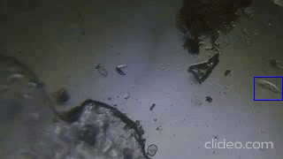

### Motion detection in microscope videos using Python and OpenCV

> This page is WIP for now !

This repository contains code to detect moving object in videos taken using microscope. Please refer to : (https://ashishware.com/2020/07/05/motiondetect/)[https://ashishware.com/2020/07/05/motiondetect/] for more details.

If you need any help or have questions, contact me on twitter: [https://twitter.com/patilsaheb](https://twitter.com/patilsaheb)
